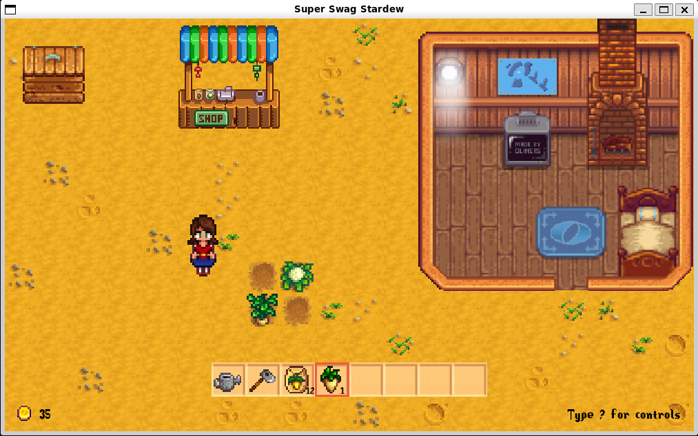

# SoftDew Valley



# Big Idea and Goal of Our Project 

We love Stardew Valley and wanted to learn more about software structures, code efficiency and integrating classes together, so we chose to create a clone of the game. This means that we made a simple farming sim where you can play as a farmer to raise and sell your crops. This was a scalable project with a lot of moving parts that we learned a lot from. Plus, it was a ton of fun!

# Unique Features of our Game 
- We implemented lots of features from the original game – for example, the abilities to plant, water, harvest, hold, and sell crops, and buy seeds. 
- We retained two of the original tools, the watering can and hoe, with full functionality. Both tools have their associated action animations from any of the four directions a player can be facing.
- The inventory holds both tools, two seeds, and open slots for harvested crops. Tools and seeds can be used by pressing the space bar, which is the general action key. Different items in the inventory can be selected by clicking on the desired tool or by pressing the inventory slot’s associated number key.
- Parsnip, cauliflower, and potato crops retain their original growth cycles and can be harvested with the h key.
- There are sound effects for tilling, watering, sowing, harvesting, and other actions.
- The farmer is controlled with WASD and has an image for each direction the player may be facing. 
- The images of free ground are randomly selected for each tile each time the game is run. 
- Music made by Stardew Valley’s creator, ConcernedApe, plays on shuffle in the background the entire time. 
- The farmer character "sleeps" and a day passes when the farmer collides with the bed. The house art is a combination of the Riverland Farmhouse pixel art from the original game as well as original pixel art by Amanda Chang, including the Olin O, the campus map, and text on the TV screen.
- The farmer can interact with the shipping bin (which opens when they are close enough to interact with), to sell crops that they harvest.
- The farmer can interact with the store by pressing E when near it to buy more seeds.

## Installation instructions
The following [link](https://github.com/olincollege/Softdew-Valley) will direct you to our github repository. From here you can download our repository and running the *main.py* file to play our game. You can use our *requirements.txt* file to install the required libraries needed to run our game. Running the following code in your terminal will install the needed libraries. 

```bash
pip install -r requirements.txt 
```

The instructions for Installation are also included in our [README.md](https://github.com/olincollege/Softdew-Valley/blob/main/README.md) file 

## Relevant links!
Our [Github Page](https://github.com/olincollege/Softdew-Valley): Here you can find our [README.md](https://github.com/olincollege/) and by clicking the green *code* button you can find a downloadable zip file.


## Video Demo 

[Our Video!](https://youtu.be/dXMlk7HN2CU)


## Credits 
The people that worked on this project were Alex George, Amanda Chang, and 
Meagan Lipsman. Our credits go to ConcernedApe(Eric Barone), the creator of Stardew Valley, and [VHV.RS](https://www.vhv.rs/viewpic/hoJTmbJ_stardew-valley-player-sprite-png-download-stardew-valley/) for our player sprite images.

## Meet Our Team!

Amanda(right), Alex(middle), Meagan(Left)

Us doing Stardew Valley "research": 


