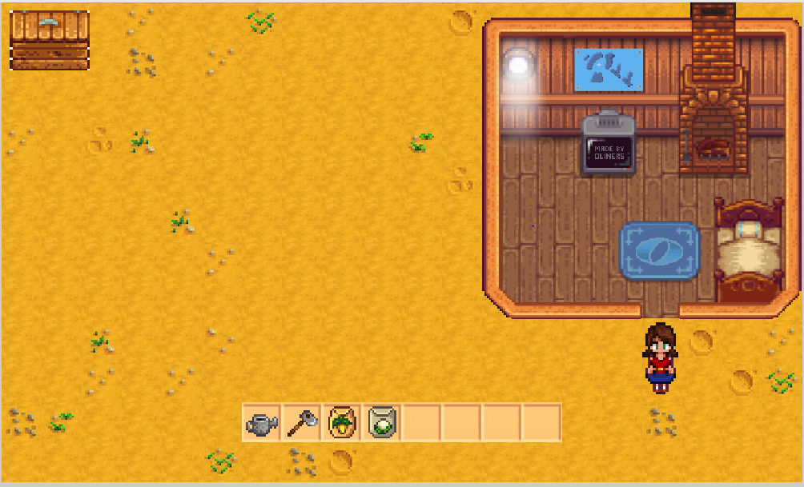
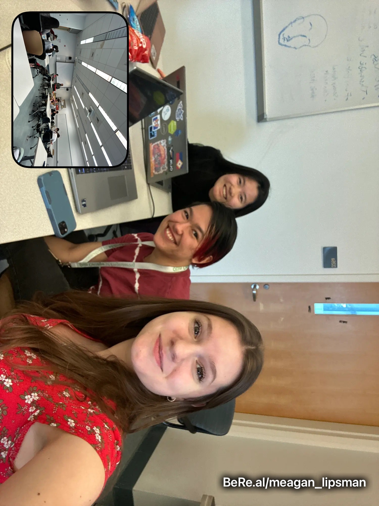
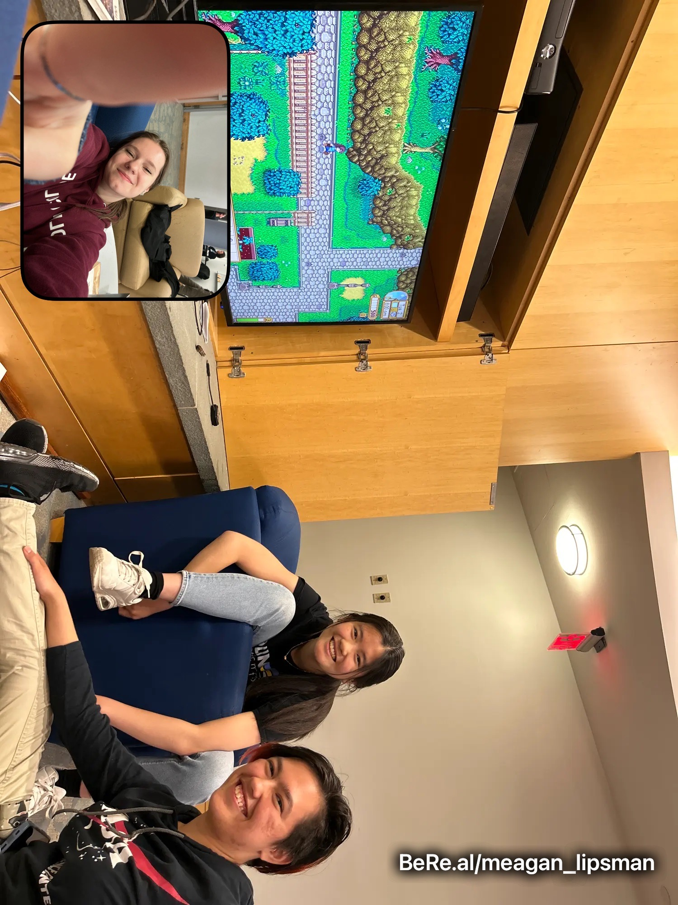

# Stardew Valley Clone

# Big Idea and Goal of Our Project 

We love Stardew Valley and wanted to learn more about software structures, code efficiency and how things work together, so we chose to create a clone of the game. There’s a lot of moving parts, the project was scaleable to how much we wanted to work on it, and we knew we could learn a lot from it. Plus, it was a ton of fun!

# Unique Features of our Game 
- We implemented lots of features from the original game – for example, the abilities to plant, water, harvest, and hold crops. 
- We retained two of the original tools, the watering can and hoe, with full functionality. Both tools have their associated action animations from any of the four directions a player can be facing.
- The inventory holds both tools, both seeds, and open slots for harvested crops. Tools and seeds can be actuated with the space bar, which is the general action key. Different items in the inventory can be selected by clicking on the desired tool or by pressing the inventory slot’s associated number key.
- Parsnip and cauliflower crops retain their original growth cycles and can be harvested with the h key.
- The original sound effects for tilling, watering, sowing, and harvesting.
- The farmer is controlled with WASD and has an image for each direction the player may be facing. 
- The images of free ground are randomly selected for each tile each time the game is run. 
- Music made by Stardew Valley’s creator, ConcernedApe, plays on shuffle in the background the entire time. 
- A house with a bed in the corner; the bed passes the day when touched by the farmer. The house features a combination of the riverland farmhouse pixel art from the original game as well as original pixel art by Amanda Chang, including the Olin O, the campus map, and text on the TV screen.

## Installation instructions (or link to the relevant portion of the README)
The following [link](https://github.com/olincollege/Stardew_Clone) will direct you to our github repository. From here you can download our repository and running the *main.py* file to play our game. To play our game you will need to install the pygame and pytest libraries. You can use the package manager [pip](https://pip.pypa.io/en/stable/) to install these libraries. You also need to install pygame dependencies as well to ensure pygame works as intended. Running the following code in your terminal with install the needed libraries. 

```bash
pip install -U pytest 
python3 -m pip install -U pygame --user
sudo apt install build-essential libsdl2-dev python3-pygame-sdl2
```

The instructions for Installation are also included in our [README.md](https://github.com/olincollege/Stardew_Clone/blob/main/README.md) file 

## Relevant links!
Our [Github Page] (https://github.com/olincollege/Stardew_Clone): Here you can find our [README.md](https://github.com/olincollege/) and by clicking the green *code* button you can find a downloadable zip file.


## Video Demo 

ADD VIDEO DEMO HERE 

## Image of our game 


## Credits 

## Meet Our Team!

Amanda(right), Alex(middle), Meagan(Left)

Us doing Stardew Valley "research": 
